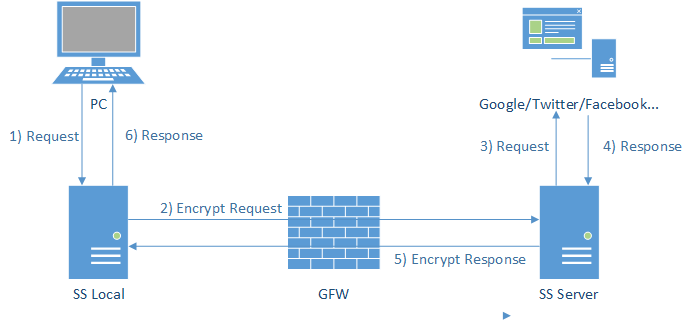

shadowsocks源码分析：ssserver
*******************************

学习shadowsocks\ [1]_\ 服务端源码。

.. author:: default
.. categories:: program
.. tags:: python, network, vpn
.. comments::
.. more::

shadowsocks的原理
===================
关于shadowsocks\ [1]_\ 的原理，这张图解释的清清楚楚。

其中: 

*   PC是需要利用shadowsocks代理的应用；
*   **SS Local**\ 为shadowsocks客户端，通常运行在PC/手机上（也可以运行在任务PC可
    以到达的位置），用于与shadowsocks服务端建立连接。
*   **GFW**\ 无需赘述了；
*   **ss server**\ shadowsocks服务端，与\ `ss local`\ 通讯，完成\ `ss local`\ 请
    求的访问，并将返回数据加密返回给\ `ss local`

**数据流向**\ ：\ [2]_

*   图中\ ``1) Request``\ 即本地应用通过\ ``sock5``\ 代理向\ `ss local`\ 发起访
    问请求
*   图中\ ``2) Encrypt Request``\ 为\ `ss local`\ 将PC的请求经加密交给\ `ss
    server`
*   `ss server`\ 收到\ `ss local`\ 的数据后解密，得到目的地址和数据，再向目的地
    址(Google/Twitter/Facebook)发起请求，即图中\ ``3) Request``
*   目的服务器(Google/Twitter/Facebook)响应\ `ss server`\ 的请求，即\ ``4)
    Response``
*   `ss server`\ 收到响应数据后，将其加密发送给\ `ss local`\ ，即:\ ``5)
    Encrypt Response``
*   `ss local`\ 收到\ `ss server`\ 发回的经加密的响应数据后，解密交给请求发起
    方PC。即：\ ``6) Response``

源码结构
==========
这里以\ **shadowsocks-2.8.2**\ 的python源代码为例来\ **分析ssserver的设计**\ 。
解开源码可以看到shadowsocks目录结构如下（crypto略去）

.. code-block:: none

    |...
    ├── shadowsocks
    │   ├── asyncdns.py
    │   ├── common.py
    │   ├── crypto
    │   │   ├── ....
    │   ├── daemon.py
    │   ├── encrypt.py
    │   ├── eventloop.py
    │   ├── __init__.py
    │   ├── local.py
    │   ├── lru_cache.py
    │   ├── manager.py
    │   ├── server.py
    │   ├── shell.py
    │   ├── tcprelay.py
    │   └── udprelay.py
    |...

其中：

*   server.py是服务端入口ssserver；
*   local.py是客户端入口sslocal；
*   tcprelay.py提供了类\ ``TCPRelay``, ``TCPRelayHandler``\ 来处理TCP连接，
    UDP相关由udprelay.py提供
*   eventloop.py提供了类\ ``EventLoop``\ 对epoll, kqueue, select方法的包装，提
    供统一的IO复用接口
*   encrypt.py提供加密解密相关接口
*   common.py包含一些通用接口

服务端数据处理流程
===================

shadowsocks服务端的启动
----------------------------

首先看一下\ ``server.py``\ 中的入口函数main中的代码段：

1.  创建\ ``TCPRelay``\ 侦听相应的端口，等待shadowsocks客户端连接。从这里可以看
    到shadowsocks的客户端同时侦听TCP和UDP端口

.. code-block:: python
    :linenos:
    :emphasize-lines: 7,8

    # file: server.py
    for port, password in port_password.items():
        a_config = config.copy()
        a_config['server_port'] = int(port)
        a_config['password'] = password
        logging.info("starting server at %s:%d" %
                     (a_config['server'], int(port)))
        tcp_servers.append(tcprelay.TCPRelay(a_config, dns_resolver, False))
        udp_servers.append(udprelay.UDPRelay(a_config, dns_resolver, False))

2.  接下来一看TCPRelay的初始化

.. code-block:: python
    :linenos:
    
    # file tcprelay.py

    class TCPRelay(object):
        # TCPRelay侦听并处理来自ss client连接请求
        def __init__(self, config, dns_resolver, is_local, stat_callback=None):
            self._config = config
            self._is_local = is_local       # 是否为ss local。False
            self._dns_resolver = dns_resolver
            self._closed = False
            self._eventloop = None
            self._fd_to_handlers = {}   # {socketfd: socket_handle}

            self._timeout = config['timeout']
            self._timeouts = []  # a list for all the handlers
            # we trim the timeouts once a while
            self._timeout_offset = 0   # last checked position for timeout
            self._handler_to_timeouts = {}  # key: handler value: index in timeouts

            if is_local:
                listen_addr = config['local_address']
                listen_port = config['local_port']
            else:
                listen_addr = config['server']
                listen_port = config['server_port']
            self._listen_port = listen_port

            # 打开一个socket，并设置相关参数，然后bind, listen
            addrs = socket.getaddrinfo(listen_addr, listen_port, 0,
                                       socket.SOCK_STREAM, socket.SOL_TCP)
            if len(addrs) == 0:
                raise Exception("can't get addrinfo for %s:%d" %
                                (listen_addr, listen_port))
            af, socktype, proto, canonname, sa = addrs[0]
            server_socket = socket.socket(af, socktype, proto)
            server_socket.setsockopt(socket.SOL_SOCKET, socket.SO_REUSEADDR, 1)
            server_socket.bind(sa)
            server_socket.setblocking(False)
            if config['fast_open']:
                try:
                    server_socket.setsockopt(socket.SOL_TCP, 23, 5)
                except socket.error:
                    logging.error('warning: fast open is not available')
                    self._config['fast_open'] = False
            server_socket.listen(1024)
            self._server_socket = server_socket
            self._stat_callback = stat_callback
    

3.  ``TCPRelay``\ 初始化完成后，返回回server.py的main函数。接下来创建了一个
    EventLoop对象，并将打开的socket注册到EventLoop

.. code-block:: python
    :linenos:
    :emphasize-lines: 16

    # file: server.py
    def main():
        # ...
        def run_server():
            # 注册signal处理函数
            # ...
            try:
                # 创建EventLoop
                loop = eventloop.EventLoop()
                dns_resolver.add_to_loop(loop)

                # 观察者模式
                # epoll/kqueue/select观察着socket的状态，当socket状态发生变化时
                # 调用消息处理函数
                # 将已经打开的socket注册到EventLoop侦听相应的事件
                list(map(lambda s: s.add_to_loop(loop), tcp_servers + udp_servers))

                daemon.set_user(config.get('user', None))
                # 启动事件循环，等待shadowsocks客户端的连接
                loop.run()
            except Exception as e:
                shell.print_exception(e)
                sys.exit(1)

        if int(config['workers']) > 1:
            #...
        run_server()

4.  看一下\ ``EventLoop``\ 的初始化和\ ``TCPRelay.add_to_loop``\ 的代码：

.. sourcecode:: python
    :linenos:
    :emphasize-lines: 18, 32, 42, 55

    # file: eventloop.py

    class EventLoop(object):
        def __init__(self):
            # 选择IO复用模式，初始化一些参数
            if hasattr(select, 'epoll'):
                self._impl = select.epoll()
                model = 'epoll'
            elif hasattr(select, 'kqueue'):
                self._impl = KqueueLoop()
                model = 'kqueue'
            elif hasattr(select, 'select'):
                self._impl = SelectLoop()
                model = 'select'
            else:
                raise Exception('can not find any available functions in select '
                                'package')
            self._fdmap = {}  # (f, handler) 此结构非重要
            self._last_time = time.time()
            self._periodic_callbacks = []
            self._stopping = False
            logging.debug('using event model: %s', model)

        def add(self, f, mode, handler):
            # 参数：
            #   f:  socket
            #   mode: 所侦听的事件
            #   handler: 事件处理对象，当socket注册的事件mode发生时，会调用
            #           handler.handle_event(...)
            fd = f.fileno()
            # 此处将(socket, handler)加入到一个字典, key为socket的文件描述符
            self._fdmap[fd] = (f, handler)
            self._impl.register(fd, mode)

        def run(self):
            events = []
            while not self._stopping:
                # ...
                asap = False
                try:
                    # 等待事件触发，返回触发的事件
                    events = self.poll(TIMEOUT_PRECISION)
                except (OSError, IOError) as e:
                    if errno_from_exception(e) in (errno.EPIPE, errno.EINTR):
                    # ...

                # 遍历被激活的事件
                for sock, fd, event in events:
                    # 根据文件描述述查找对应的handle。在self.add函数加注册的
                    handler = self._fdmap.get(fd, None)
                    if handler is not None:
                        handler = handler[1]
                        try:
                            # 调用相关_handle_event方法，处理事件
                            handler.handle_event(sock, fd, event)
                        # ...

5.  再来看看\ ``TCPRelay.add_to_loop``\ 做了什么
    
.. code-block:: python 
    :linenos:
    :emphasize-lines: 11

    # file: tcprelay.py
    class TCPRelay(object):
        # ...
        def add_to_loop(self, loop):
            if self._eventloop:
                raise Exception('already add to loop')
            if self._closed:
                raise Exception('already closed')
            self._eventloop = loop
            # 调用EventLoop的add方法注册自身打开的socket
            self._eventloop.add(self._server_socket,
                                eventloop.POLL_IN | eventloop.POLL_ERR, self)
            # 调用EventLoop的add_periodic方法注册一个周期处理函数，
            # 清理失效的socket
            self._eventloop.add_periodic(self.handle_periodic)

到这里，shadowsocks服务端就算启动完成了，就等shadowsocks客户端来连接了。回顾一下做了些什么：

*   根据配置文件打开指定的TCP/UDP端口
*   建立一个IO复用对象EventLoop，并注册socket的读事件(\ ``eventloop.POLL_IN``\）
*   启动EventLoop，等待shadowsocks连接。

shadowsocks客户端连接服务端
-----------------------------
当shadowsocks客户端连接到服务端时，EventLoop中就会产生相关的事件，并调用对应的
``TCPRelay.handle_event``\ 方法来处理事件。

1.  shadowsocks客户端向服务端发起连接，将触发TCPRelay的socket的
    ``EventLoop.POLL_IN``\ 事件。即会调用\ ``TCPRelay.handle_event``\ 方法。
    shodowsocks服务端接受连接，并创建一个\ ``TCPRelayHandler``\ 来管理，
    即由TCPRelayHandler与shadowsocks客户端通讯。初始连接事件处理完，Eventloop又
    进入待机状态，

.. code-block:: python
    :linenos:
    :emphasize-lines: 16, 18, 28, 31

    # file: tcprelay.py
    class TCPRelay(object):
        def handle_event(self, sock, fd, event):
            # handle events and dispatch to handlers
            if sock:
                logging.log(shell.VERBOSE_LEVEL, 'fd %d %s', fd,
                            eventloop.EVENT_NAMES.get(event, event))
            # 如果事件来自self._server_socket(服务端侦听socket)
            if sock == self._server_socket:
                if event & eventloop.POLL_ERR:
                    # TODO
                    raise Exception('server_socket error')
                try:
                    logging.debug('accept')
                    # 接受新的客户端连接
                    conn = self._server_socket.accept()
                    # 建立TCPRelayHandler来管理客户端
                    TCPRelayHandler(self, self._fd_to_handlers,
                                    self._eventloop, conn[0], self._config,
                                    self._dns_resolver, self._is_local)
                except (OSError, IOError) as e:
                # ...
            else:
            # 如果事件是由其它socket触发的，
            # 且sock是有效的
                if sock:
                    # 根据fd查找到对应的handler
                    handler = self._fd_to_handlers.get(fd, None)
                    if handler:
                        # 调用handler.handle_event来处理事件
                        handler.handle_event(sock, event)
            # ...

2.  第一步中，当一个客户端连接上服务端后，建立一个新的\ ``TCPRelayHandler``\ 来
    管理客户端，看看\ ``TCPRelayHandler``\ 的初始化做了什么：

.. code-block:: python
    :linenos:
    :emphasize-lines: 7, 13, 17

    # file: tcprelay.py
    class TCPRelayHandler(object):
        def __init__(self, server, fd_to_handlers, loop, local_sock, config,
                     dns_resolver, is_local):
            # 创建当前对象的TCPRelay对象
            self._server = server
            self._fd_to_handlers = fd_to_handlers
            self._loop = loop
            # 与ss client的socket连接
            self._local_sock = local_sock
            # ...
            # 请注意初始状态值
            self._stage = STAGE_INIT
            self._upstream_status = WAIT_STATUS_READING
            self._downstream_status = WAIT_STATUS_INIT
            # ...
            # 将socket(与ss client连接)加入到TCPRelay的fd_to_handlers的字典中
            # 此时字典里只有一项（假定当前是第一个也是唯一一个ss client的连接）
            # 即ss client与ss server的连接socket
            fd_to_handlers[local_sock.fileno()] = self
            local_sock.setblocking(False)
            local_sock.setsockopt(socket.SOL_TCP, socket.TCP_NODELAY, 1)
            # 将与ss client连接的socket注册至EventLoop。首先注册的是POLL_IN事件
            # socket被添加到EventLoop的字典_fdmap中
            loop.add(local_sock, eventloop.POLL_IN | eventloop.POLL_ERR,
                     self._server)
            self.last_activity = 0
            # 更新活动信息，以免被TCPRelay清理
            self._update_activity()

这样，\ *ss client*\ 就与\ *ss server*\ 建立了连接，EventLoop开始侦听与\
`ss client`\ 连接的socket。

shadowsocks客户端向服务端发送数据
-----------------------------------
当\ `ss local`\ 与\ `ss server`\ 建立好连接之后，socket即处理EvetLoop的监听下。
`ss local`\ 开始向\ `ss server`\ 发送数据。EventLoop会调用\
``TCPRelay.handle_event``\ 并通过查找\ ``TCPRelay._fd_to_handles``\ ，最终调用
``TCPRelayHandler.handle_event``\ 方法来处理。

1.  `ss local`\ 向\ `ss server`\ 发送请求数据。调用\
    ``TCPRelayHandler.handle_event``\ 来处理。因为是\ `ss local` -> `ss server`
    所以socket是\ ``TCPRelayHandler._local_sock``, 最后会调用
    ``TCPRelayHandler._on_local_read()``\ 来处理

.. code-block:: python
    :linenos:
    :emphasize-lines: 6, 10, 22

    # file: tcprelay.py
    class TCPRelayHandler(object):
        # ...
        def handle_event(self, sock, event):
            # handle all events in this handler and dispatch them to methods
            if self._stage == STAGE_DESTROYED:
                logging.debug('ignore handle_event: destroyed')
                return
            # order is important
            if sock == self._remote_sock:
                if event & eventloop.POLL_ERR:
                    self._on_remote_error()
                    if self._stage == STAGE_DESTROYED:
                        return
                if event & (eventloop.POLL_IN | eventloop.POLL_HUP):
                    self._on_remote_read()
                    if self._stage == STAGE_DESTROYED:
                        return
                if event & eventloop.POLL_OUT:
                    self._on_remote_write()
            # 是ss local与ss server间的socket触发了事件
            elif sock == self._local_sock:
                if event & eventloop.POLL_ERR:
                    self._on_local_error()
                    if self._stage == STAGE_DESTROYED:
                        return
                # 如果为读事件，即ss local向ss server发送请求
                if event & (eventloop.POLL_IN | eventloop.POLL_HUP):
                    self._on_local_read()
                    if self._stage == STAGE_DESTROYED:
                        return
                # 如果为可写事件
                if event & eventloop.POLL_OUT:
                    self._on_local_write()
            else:
                logging.warn('unknown socket')
        # ...

2.  接下来看看\ ``TCPRelayHandler.on_local_read()``\ 如何处理\ ``ss local``\ 的
    请求。

.. code-block:: python
    :linenos:
    :emphasize-lines: 6, 10, 22

    # file: tcprelay.py
    class TCPRelayHandler(object):
        def _on_local_read(self):
            # handle all local read events and dispatch them to methods for
            # each stage
            if not self._local_sock:
                return
            is_local = self._is_local
            data = None
            try:
                # 从socket读取数据
                data = self._local_sock.recv(BUF_SIZE)
            # ...
            if not is_local:
                # 由于当前是 ss server，所以走向此分支
                # 将数据解密
                data = self._encryptor.decrypt(data)
                if not data:
                    return
            # 检查状态
            if self._stage == STAGE_STREAM:
                if self._is_local:
                    data = self._encryptor.encrypt(data)
                self._write_to_sock(data, self._remote_sock)
                return
            # 当前是ss server
            elif is_local and self._stage == STAGE_INIT:
                # TODO check auth method
                self._write_to_sock(b'\x05\00', self._local_sock)
                self._stage = STAGE_ADDR
                return
            elif self._stage == STAGE_CONNECTING:
                self._handle_stage_connecting(data)
            elif (is_local and self._stage == STAGE_ADDR) or \
                    (not is_local and self._stage == STAGE_INIT):
                # 第一个数据包的处理来到这一步
                self._handle_stage_addr(data)

        def _handle_stage_addr(self, data):
            try:
                if self._is_local:
                    # ...
                # 解析ss local的数据包
                header_result = parse_header(data)
                # ...
                # 得到ss local想要连接到remote主机和数据
                addrtype, remote_addr, remote_port, header_length = header_result
                logging.info('connecting %s:%d from %s:%d' %
                             (common.to_str(remote_addr), remote_port,
                              self._client_address[0], self._client_address[1]))
                self._remote_address = (common.to_str(remote_addr), remote_port)
                # pause reading
                # 改变与ss local连接socket的侦听事件？
                self._update_stream(STREAM_UP, WAIT_STATUS_WRITING)
                # 进入到STAGE_DNS态
                self._stage = STAGE_DNS
                if self._is_local:
                    # ...
                else:
                    if len(data) > header_length:
                        # 将ss local的请求数据写入值缓冲队列
                        self._data_to_write_to_remote.append(data[header_length:])
                    # notice here may go into _handle_dns_resolved directly
                    # 解析ss local请求的域名
                    # 完成后调用TCPRelayHandler._handle_dns_resolved()
                    self._dns_resolver.resolve(remote_addr,
                                               self._handle_dns_resolved)
            except Exception as e:
                # ...
        # ...

        # 此函数有点让人晕
        def _update_stream(self, stream, status):
            # update a stream to a new waiting status

            # check if status is changed
            # only update if dirty
            dirty = False
            if stream == STREAM_DOWN:
                if self._downstream_status != status:
                    self._downstream_status = status
                    dirty = True
            elif stream == STREAM_UP:
                if self._upstream_status != status:
                    self._upstream_status = status
                    dirty = True
            if dirty:
                if self._local_sock:
                    event = eventloop.POLL_ERR
                    if self._downstream_status & WAIT_STATUS_WRITING:
                        event |= eventloop.POLL_OUT
                    if self._upstream_status & WAIT_STATUS_READING:
                        event |= eventloop.POLL_IN
                    self._loop.modify(self._local_sock, event)
                if self._remote_sock:
                    event = eventloop.POLL_ERR
                    if self._downstream_status & WAIT_STATUS_READING:
                        event |= eventloop.POLL_IN
                    if self._upstream_status & WAIT_STATUS_WRITING:
                        event |= eventloop.POLL_OUT
                    self._loop.modify(self._remote_sock, event)

        # 客户端请求的域名解析完成
        def _handle_dns_resolved(self, result, error):
            if error:
                self._log_error(error)
                self.destroy()
                return
            if result:
                ip = result[1]
                if ip:

                    try:
                        self._stage = STAGE_CONNECTING
                        remote_addr = ip
                        if self._is_local:
                            remote_port = self._chosen_server[1]
                        else:
                            remote_port = self._remote_address[1]

                        if self._is_local and self._config['fast_open']:
                            # ...
                        else:
                            # else do connect
                            # 非常重要!!
                            # 创建一个到remote主机的socket，并将socket的文件描述
                            # 符和socket添加到TCPRelay的字典
                            # TCPRelay._fd_to_handler中
                            remote_sock = self._create_remote_socket(remote_addr,
                                                                     remote_port)
                            try:
                                # 连接remote主机（ss local请求的地址）
                                remote_sock.connect((remote_addr, remote_port))
                            except (OSError, IOError) as e:
                                if eventloop.errno_from_exception(e) == \
                                        errno.EINPROGRESS:
                                    pass
                            # 注册可写事件。是不是只要可写立即就会触发？
                            # 如果是，马上会调用TCPRelayHandler._on_remote_wirte()
                            # 将ss local请求的数据发送到remote主机
                            self._loop.add(remote_sock,
                                           eventloop.POLL_ERR | eventloop.POLL_OUT,
                                           self._server)
                            # TCPRelayHandler进入STAGE_CONNECTING态
                            self._stage = STAGE_CONNECTING
                            # 更新stream状态
                            self._update_stream(STREAM_UP, WAIT_STATUS_READWRITING)
                            self._update_stream(STREAM_DOWN, WAIT_STATUS_READING)
                        return
                    except Exception as e:
                        shell.print_exception(e)
                        if self._config['verbose']:
                            traceback.print_exc()
            self.destroy()

3.  此时TCPRelayHandler已经将\ `ss local`\ 的请求数据发送给的remote主机，当远程主
    机发回响应数据给\ `ss server`\ 时，会触发TCPRelayHandler._remote_socket的读事
    件。最终会调用\ ``TCPRelayHandler._on_remote_read``\ 方法：

.. sourcecode: python
    :linenos:

    # file: tcprelay.py
    class TCPRelayHandler(object):
        def _on_remote_read(self):
            # handle all remote read events
            data = None
            try:
                # 读取来自remote的数据
                data = self._remote_sock.recv(BUF_SIZE)

            # ...
            # 更新socket活跃状态
            self._update_activity(len(data))
            if self._is_local:
                data = self._encryptor.decrypt(data)
            else:
                # 将remote返回的数据加密
                data = self._encryptor.encrypt(data)
            try:
                # 将加密后的数据发送给ss local
                self._write_to_sock(data, self._local_sock)
            # ...

即此时，\ `ss local`\ 完成了一次与\ `ss server`\ 的代理访问：

1.  `ss local`\ 将想要访问的地址和数据加密将给\ `ss server`
2.  `ss server`\ 将\ `ss local`\ 的请求数据解密，并向remote主机发送请求
3.  remote主机将响应数据发送给\ `ss server`\ ，\ `ss server`\ 将响应数据加密发送
    给\ `ss local`

注意：
    
1.  ``TCPRelay``\ 对应着一个\ `ss server`\ 的侦听端口，主要负责处理与\ `ss local`
    的连接
2.  ``TCPRelayHandler``\ 对应着一条\ `ss local`\ 与\ `ss server`\ 间的TCP链接，
    同时管理着一条\ `ss server`\ 与remote主机的连接。

不解
=========
1.  侦听与\ `ss local`\ 连接socket事件时，为什么在侦听读和侦听写之间切换？同时侦
    听两个事件有什么问题？
2.  由于\ ``TCPRelayHandler``\ 只能管理一条\ `ss server`\ 与remote的连接，且除第
    一个数据包之外，后续数据，\ `ss server`\ 都是收到之后直接交给remote。如此则
    要求\ `ss local`\ 针对每一个不同域名/IP，需要与\ `ss server`\ 建立一条TCP链
    接？

.. todo::

    1.  阅读local代码
    1.  阅读dns解析，配置管理的代码

参数资料
=========

.. [1]  `Shadowsocks <https://shadowsocks.org>`_
.. [2]  `写给非专业人士看的 Shadowsocks 简介
        <http://vc2tea.com/whats-shadowsocks/>`_
