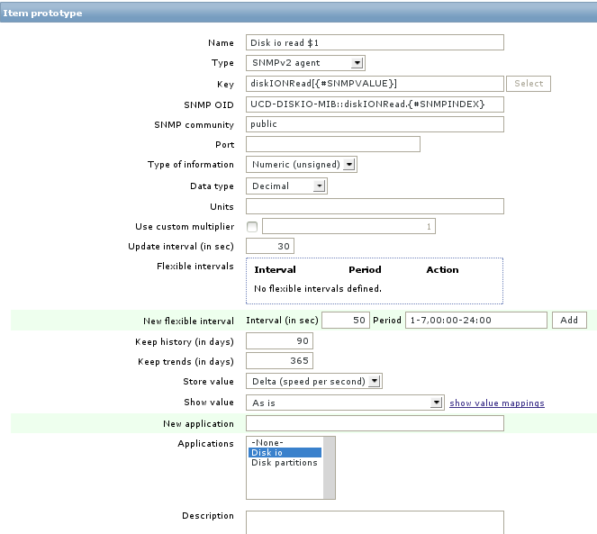

配置Zabbix
***************

安装
=====

建立数据库
-----------

配置PHP
----------
需要修改PHP的默认参数

.. sourcecode:: ini

   max_execution_time = 300
   memory_limit = 128M
   post_max_size = 16M
   upload_max_filesize = 2M
   max_input_time = 300
   # date.timezone = Europe/Riga

配置Zabbix Server
------------------

配置Zabbix Agent
------------------

SNMP Discovery
===============
**Zabbix**\ 自身带有不少请求SNMP数据的模板可以使用，不过通过自定义的可以获取更\
多的数据。例如：磁盘的IO，CPU的负载，TCP的连接情况等等。

在\ **Zabbix**\ 的\ `手册`_\ 中对如何自定义SNMP discovery 策略有介绍，在此，结\
合自己的的经历详细说明如何添加自定义 *discovery, item prototypes*\ 等。

首先需要对Net-SNMP的MIB有一点点了解，在此以添加对Disk IO的监控为例，相关OID其\
OID为：”\ **.1.3.6.1.4.1.2021.13.15.1.1.**\ “。树形结构为：

+--------------------------------+--------------------------------------------+
|   OID                          |   Mean                                     |
+================================+============================================+
| .1.3.6.1.4.1.2021.13.15.1.1    | UCD-DISKIO-MIB\:\:                         |
+--------------------------------+--------------------------------------------+
| .1.3.6.1.4.1.2021.13.15.1.1.1  | diskIOIndex                                |
+--------------------------------+--------------------------------------------+
| .1.3.6.1.4.1.2021.13.15.1.1.2  | diskIODevice（设备名）                     |
+--------------------------------+--------------------------------------------+
| .1.3.6.1.4.1.2021.13.15.1.1.3  | diskIONRead                                |
+--------------------------------+--------------------------------------------+
| .1.3.6.1.4.1.2021.13.15.1.1.4  | diskIONWritten                             |
+--------------------------------+--------------------------------------------+
| .1.3.6.1.4.1.2021.13.15.1.1.5  | diskIOReads                                |
+--------------------------------+--------------------------------------------+
| .1.3.6.1.4.1.2021.13.15.1.1.6  | diskIOWrites                               |
+--------------------------------+--------------------------------------------+
| .1.3.6.1.4.1.2021.13.15.1.1.9  | diskIOLA1                                  |
+--------------------------------+--------------------------------------------+
| .1.3.6.1.4.1.2021.13.15.1.1.10 | diskIOLA5                                  |
+--------------------------------+--------------------------------------------+
| .1.3.6.1.4.1.2021.13.15.1.1.11 | diskIOLA15                                 |
+--------------------------------+--------------------------------------------+
| .1.3.6.1.4.1.2021.13.15.1.1.12 | diskIONReadX                               |
+--------------------------------+--------------------------------------------+
| .1.3.6.1.4.1.2021.13.15.1.1.13 | diskIONWrittenX                            |
+--------------------------------+--------------------------------------------+

MIB的信息可以通过\ `oid-info`_\ 查看。接下假定你有一个正常运行的\ **snmpd**\ 服\
务。命令：\ ``snmpwalk -v 2c -c public localhost .1.3.6.1.4.1.2021.13.15.1.1.3``
可查询到本机各磁盘从开机到当前读取了多少字节。

新建\ **discovery**\ 条目
-------------------------
* 打开Zabbix监控页面后，进入"**configuration**" --> "**Templates**"，在此将磁盘\
  IO监控项放入到模板"**Template SNMP Disks**"（仅为方便归类，可任意）。

* 进入"**Template SNMP Disks**"的"**discovery**"，点击右上方的"**Create discovery
  rule**"新建一条发现策略。内容填写如下图所示。

.. image:: images/discovery.png

其中需要注意的是：

    * **Type**\ 一定要选择"**SNMP ***"，版本根据"**snmpd**"提供来选择
    * **key**\ 和\ **SNMP OID**\ 一定要设定为"**UCD-DISKIO-MIB::diskIODevice**\ 和\
      **diskIODevice**\ 这与后面"**item prototypes**"的名称有莫大的关联。如果自定义\
      其它SNMP信息，应该将其设定为对应的item name。
    * **Name**\ 是自定义的，其它参数都是默认。
    
    * 建立好\ **discovery rule**\ 后，再新建\ **item prototypes**\。点击新建的策略"\
      **Disk io**\  进入其\ **item prototypes**\ 新建发现的项目，内容填写如下图所示：

其中需要注意的是：

    * **SNMP OID**\ 填为你希望获取数据的OID，注意一般会加上一个Zabbix宏"\
      **#SNMPINDEX**"，这主要是因为snmpd返回的数据一般为很多项，它会自动建立一个索\
      引来对应不同项。此项我们读取磁盘的读操作数据。
    * **key**\ 
    * 另外还有\ **Store value**\ 和\ **show value**\ 等其它选项，根据数据特点设定。
      由于此处snmpd返回的是从开机到当前的总读取数据量，所以存储值选择"**Delta**"

.. todo::

    补充，完善

.. _手册:      https://www.zabbix.com/documentation/2.0/manual/discovery/low_level_discovery
.. _oid-info:  http://oid-info.com/index.htm

安装中可能的问题
===================

Log File Monitoring时ZBX_NOTSUPPORT错误
---------------------------------------
配置日志文件监控时一直出错，经过在Zabbix Forums上的提醒\ [#r1]_\ ，仔细查看了agent\
的调试日志，在其中发现：

.. sourcecode:: text

    # ACTIVE CHECK 主机上没有查询时，返回的data为空。

    2526:20130418:020747.866 refresh_active_checks('lab.liuhui.xmu',10051)
    2525:20130418:020747.867 agent #1 started [listener]
    2526:20130418:020747.867 Sending [{
      "host":"node01.liuhui.xmu",
      "ip":"192.168.122.11"}]
    2526:20130418:020747.868 Before read
    2524:20130418:020747.868 agent #0 started [collector]
    2524:20130418:020747.868 In init_cpu_collector()
    2524:20130418:020747.868 End of init_cpu_collector():SUCCEED
    2524:20130418:020747.868 In update_cpustats()
    2524:20130418:020747.868 End of update_cpustats()
    2526:20130418:020747.869 Got [{
      "response":"success",
      "data":[]}]
    2526:20130418:020747.869 In parse_list_of_checks()
    2526:20130418:020747.869 In disable_all_metrics()
    2526:20130418:020747.869 In process_active_checks('lab.liuhui.xmu',10051)
    2526:20130418:020747.869 End of process_active_checks()

    # 这是另外一个ACTIVE CHECK日志，此时我定义了一个日志监视的item
    # 可以发现agent已经开始处理日志文件，但是没有相应的权限，最终出错，返回
    # ZBX_NOTSUPPORT

    4320:20130418:165640.307 refresh_active_checks('lab.liuhui.xmu',10051)
    4320:20130418:165640.308 Sending [{
        "request":"active checks",
        "host":"node01.liuhui.xmu",
        "ip":"192.168.122.11"}]
    4320:20130418:165640.309 Before read
    4320:20130418:165640.310 Got [{
        "response":"success",
        "data":[
                {
                    "key":"log[\/var\/log\/messages,,,,]",
                    "delay":30,
                    "lastlogsize":0,
                    "mtime":0}]}]
    4320:20130418:165640.310 In parse_list_of_checks()
    4320:20130418:165640.310 In disable_all_metrics()
    4320:20130418:165640.310 In add_check() key:'log[/var/log/messages,,,,]' refresh:30 lastlogsize:0 mtime:0
    4320:20130418:165640.310 End of add_check()
    4320:20130418:165640.310 In process_active_checks('lab.liuhui.xmu',10051)
    4320:20130418:165640.310 In process_log() filename:'/var/log/messages' lastlogsize:0
    4320:20130418:165640.310 cannot open '/var/log/messages': [13] Permission denied
    4320:20130418:165640.310 Active check [log[/var/log/messages,,,,]] is not supported. Disabled.
    4320:20130418:165640.310 In process_value() key:'node01.liuhui.xmu:log[/var/log/messages,,,,]' value:'ZBX_NOTSUPPORTED'

    # 再看看下面的日志，这是agent输出的一个成功的日志监控的调试日志
    # 与上面的主要差别在于，agent进程有权限访问server要求监控的日志文件

    3904:20130419:020817.682 refresh_active_checks('lab.liuhui.xmu',10051)        
    3904:20130419:020817.683 Sending [{                                           
      "request":"active checks",                                                  
      "host":"node01.liuhui.xmu",                                                 
      "ip":"192.168.122.11"}]                                                     
    3904:20130419:020817.683 Before read                                          
    3904:20130419:020817.684 Got [{                                               
      "response":"success",                                                       
      "data":[                                                                    
        {"key":"log[\/var\/log\/zabbix\/zabbix_agentd.log]",
         "delay":30,
         "lastlogsize":0,
         "mtime":0}]}]
    3904:20130419:020817.684 In parse_list_of_checks()
    3904:20130419:020817.684 In disable_all_metrics()
    3904:20130419:020817.684 In add_check() key:'log[/var/log/zabbix/zabbix_agentd.log]' refresh:30 lastlogsize:0 mtime:0
    3904:20130419:020817.684 End of add_check()     
    
    3904:20130419:020817.685 In process_active_checks('lab.liuhui.xmu',10051)
    3904:20130419:020817.685 In process_log() filename:'/var/log/zabbix/zabbix_agentd.log' last
    gsize:0
    3904:20130419:020817.685 In process_value() key:'node01.liuhui.xmu:log[/var/log/zabbix/zabb_agentd.log]' value:'  2058:20130417:235114.399 Starting Zabbix Agent [node01.liuhui.xmu].
    bbix 2.0.5 (revision 33558).'
    3904:20130419:020817.685 In send_buffer() host:'lab.liuhui.xmu' port:10051 values:0/100
    3904:20130419:020817.685 End of send_buffer():SUCCEED
    3904:20130419:020817.685 buffer: new element 0
    3904:20130419:020817.685 End of process_value():SUCCEED
    3904:20130419:020817.685 In process_log() filename:'/var/log/zabbix/zabbix_agentd.log' lastlogsize:101
    3904:20130419:020817.685 In process_value() key:'node01.liuhui.xmu:log[/var/log/zabbix/zabb_agentd.log]' value:'  2062:20130417:235114.420 agent #3 started [listener]'
    3904:20130419:020817.685 In send_buffer() host:'lab.liuhui.xmu' port:10051 values:1/100
    3904:20130419:020817.685 JSON before sending [{
      "request":"agent data",
      "data":[
          {
              "host":"node01.liuhui.xmu",
              "key":"log[\/var\/log\/zabbix\/zabbix_agentd.log]",
              "value":"  2058:20130417:235114.399 Starting Zabbix Agent [node01.liuhui.xmu]. Zabbix 2.0.5 (revision 33558).",
                "lastlogsize":101,
                "clock":1366308497,
                "ns":685378025}],
        "clock":1366308497,
        "ns":685485907}]
    3904:20130419:020817.686 JSON back [{
      "response":"success",
      "info":"Processed 1 Failed 0 Total 1 Seconds spent 0.000075"}]
    3904:20130419:020817.686 In check_response() response:'{
    ……

通过上面的日志分析，可以发现，server监视agent上的日志文件，需要agent进程可以读\
取相应的文件，否则会出错。关于监控日志的详细文档见Zabbix Manual [#r2]_\ [#r3]_

参考资料
=========
.. [#r1] https://www.zabbix.com/forum/showthread.php?t=23033
.. [#r2] https://www.zabbix.com/documentation/2.0/manual/config/items/itemtypes/log_items
.. [#r3] https://www.zabbix.com/documentation/2.0/manual/config/items/itemtypes/zabbix_agent#supported_item_keys

TODO List
=========
* 如何在agent上可以查询自身数据, 命令\ ``zabbix_agentd``\ 可以打印zabbix agent的\
  数据

.. sourcecode:: bash

    zabbix_agentd -p

* 使用IP/域名配置Server，agent
